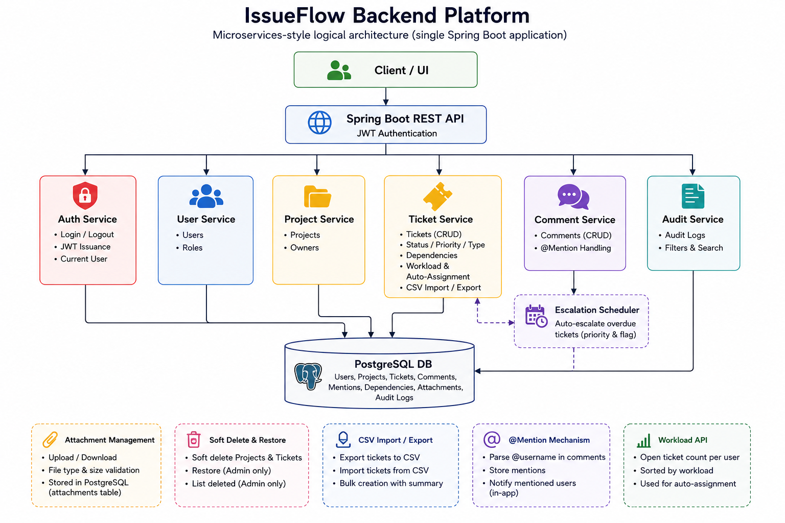

<p align="center">
  <a href="https://spring.io/projects/spring-boot" target="blank"></a>
</p>

# IssueFlow – Ticket Management Backend Platform

## Overview
IssueFlow is a backend service designed to handle a lightweight project and issue tracking platform.
The system manages users, projects, tickets, comments, audit logs, ticket dependencies, attachments, mentions, workload reporting, automatic assignment, automatic escalation, soft delete and restore, and bulk ticket import/export.

## Implementation Status

This repository contains the completed IssueFlow backend implementation for the assignment API contract below. It is a single Spring Boot application with logical service boundaries for authentication, users, projects, tickets, comments, audit logs, dependencies, attachments, CSV import/export, mentions, workload, auto-assignment, and auto-escalation.

## Functionality
The system provides the following APIs:

- **Users API**: Manages user identities behind ticket assignments and comments.
- **Projects API**: Manages top-level containers that group related tickets.
- **Tickets API**: Manages the core work items (issues) tracked in the system.
- **Comments API**: Manages user comments on tickets.
- **Audit Log API**: Read-only log of all state-changing actions in the system.
- **Dependencies API**: Manages ticket-to-ticket blocker relationships.
- **Attachments API**: Manages file attachments on tickets.
- **Export/Import API**: Supports bulk ticket export and import via CSV.
- **Soft Delete API**: Tickets and projects are soft-deleted and can be restored by ADMIN users.
- **Mentions API**: `@username` mentions in comments are validated, persisted, and retrievable per user.
- **Auto-Escalation**: A background scheduler automatically escalates ticket priority when a `dueDate` is exceeded.
- **Auto-Assignment**: Tickets without an explicit assignee are automatically assigned to the least-loaded DEVELOPER by project workload.

## Technical Aspects
The system is built as a Java 21, Spring Boot 3.4.2, Maven backend. PostgreSQL is provided through Docker Compose for local development. The application uses Spring Data JPA/Hibernate for persistence, Spring Security with JWT for authentication, BCrypt password hashing, Jakarta Bean Validation, centralized error handling, optimistic locking through JPA `@Version`, and focused automated tests.

All endpoints require JWT authentication except `POST /users` and `POST /auth/login`. The local JWT signing secret and database password are development-only values and must be changed or externalized before deployment.

## Project System Design Diagram



The diagram shows microservices-style logical architecture implemented inside a single Spring Boot application. Client/UI calls the backend through JWT-authenticated REST APIs. The Spring Boot backend contains logical modules for auth, users, projects, tickets, comments, audit logs, dependencies, attachments, workload, auto-assignment, CSV import/export, mentions, and auto-escalation.

PostgreSQL stores all application data, including users, projects, tickets, comments, mentions, dependencies, attachments, and audit logs. The escalation scheduler runs inside the application and updates overdue tickets. Auto-assignment runs during ticket creation when `assigneeId` is omitted. The API tables below remain authoritative for the exposed REST endpoints.

## Assignment Scope
The backend implements the assignment APIs with RESTful endpoints, request validation, consistent error handling, security where required, persistence, auditability, and automated tests.

---

## APIs

### Users APIs

| API Description      | Endpoint                    | Request Body                                                                                          | Response Status | Response Body                                                                                                        |
|----------------------|-----------------------------|-------------------------------------------------------------------------------------------------------|-----------------|----------------------------------------------------------------------------------------------------------------------|
| Get all users        | GET /users                  |                                                                                                       | 200 OK          | `[ { "id": 1, "username": "jdoe", "email": "jdoe@example.com", "fullName": "John Doe", "role": "DEVELOPER" } ]`    |
| Get user by ID       | GET /users/:userId          |                                                                                                       | 200 OK          | `{ "id": 1, "username": "jdoe", "email": "jdoe@example.com", "fullName": "John Doe", "role": "DEVELOPER" }`        |
| Create a user        | POST /users                 | `{ "username": "jdoe", "email": "jdoe@example.com", "fullName": "John Doe", "role": "DEVELOPER", "password": "secret" }` | 200 OK | `{ "id": 1, "username": "jdoe", "email": "jdoe@example.com", "fullName": "John Doe", "role": "DEVELOPER" }`        |
| Update a user        | POST /users/update/:userId  | `{ "fullName": "Jane Doe", "role": "ADMIN" }`                                                         | 200 OK          |                                                                                                                      |
| Delete a user        | DELETE /users/:userId       |                                                                                                       | 200 OK          |                                                                                                                      |
---
### Authentication APIs

| API Description         | Endpoint         | Request Body                                          | Response Status | Response Body |
|-------------------------|------------------|-------------------------------------------------------|-----------------|---------------|
| Login (obtain JWT)      | POST /auth/login | `{ "username": "jdoe", "password": "secret" }`       | 200 OK          | `{ "accessToken": "<jwt>", "tokenType": "Bearer", "expiresIn": 3600 }` |
| Logout (invalidate token) | POST /auth/logout |                                                     | 200 OK          | |
| Get current user        | GET /auth/me     |                                                       | 200 OK          | `{ "id": 1, "username": "jdoe", "email": "jdoe@example.com", "fullName": "John Doe", "role": "DEVELOPER" }` |

---

### Projects APIs

| API Description       | Endpoint                          | Request Body                                                                   | Response Status | Response Body                                                                                                    |
|-----------------------|-----------------------------------|--------------------------------------------------------------------------------|-----------------|------------------------------------------------------------------------------------------------------------------|
| Get all projects      | GET /projects                     |                                                                                | 200 OK          | `[ { "id": 1, "name": "Sample Project", "description": "A sample project", "ownerId": 1 } ]`                   |
| Get project by ID     | GET /projects/:projectId          |                                                                                | 200 OK          | `{ "id": 1, "name": "Sample Project", "description": "A sample project", "ownerId": 1 }`                       |
| Create a project      | POST /projects                    | `{ "name": "Sample Project", "description": "A sample project", "ownerId": 1 }` | 200 OK        | `{ "id": 1, "name": "Sample Project", "description": "A sample project", "ownerId": 1 }`                       |
| Update a project      | PATCH /projects/:projectId        | `{ "name": "Updated Name", "description": "Updated description" }`             | 200 OK          |                                                                                                                  |
| Soft-delete a project | DELETE /projects/:projectId       |                                                                                | 200 OK          |                                                                                                                  |


---

### Tickets APIs

| API Description               | Endpoint                                   | Request Body                                                                                                                               | Response Status | Response Body                                                                                                                                                                |
|-------------------------------|--------------------------------------------|--------------------------------------------------------------------------------------------------------------------------------------------|-----------------|------------------------------------------------------------------------------------------------------------------------------------------------------------------------------|
| Get tickets by project        | GET /tickets?projectId=:projectId          |                                                                                                                                                         | 200 OK          | `[ { "id": 1, "title": "Fix login bug", "description": "...", "status": "TODO", "priority": "HIGH", "type": "BUG", "projectId": 1, "assigneeId": 2, "dueDate": "2026-04-01T00:00:00Z", "isOverdue": false } ]` |
| Get ticket by ID              | GET /tickets/:ticketId                     |                                                                                                                                                         | 200 OK          | `{ "id": 1, "title": "Fix login bug", "description": "...", "status": "TODO", "priority": "HIGH", "type": "BUG", "projectId": 1, "assigneeId": 2, "dueDate": "2026-04-01T00:00:00Z", "isOverdue": false }` |
| Create a ticket               | POST /tickets                              | `{ "title": "Fix login bug", "description": "...", "status": "TODO", "priority": "HIGH", "type": "BUG", "projectId": 1, "assigneeId": 2, "dueDate": "2026-04-01T00:00:00Z" }` | 200 OK          | `{ "id": 1, "title": "Fix login bug", "description": "...", "status": "TODO", "priority": "HIGH", "type": "BUG", "projectId": 1, "assigneeId": 2, "dueDate": "2026-04-01T00:00:00Z", "isOverdue": false }` |
| Update a ticket               | PATCH /tickets/:ticketId                   | `{ "title": "...", "description": "...", "status": "IN_PROGRESS", "priority": "MEDIUM", "assigneeId": 3, "dueDate": "2026-04-01T00:00:00Z" }`    | 200 OK          |                                                                                                                                                                                                                      |
| Soft-delete a ticket          | DELETE /tickets/:ticketId                  |                                                                                                                                                         | 200 OK          |                                                                                                                                                                              |
| Export tickets to CSV         | GET /tickets/export?projectId=:projectId   |                                                                                                                                            | 200 OK          | CSV file with fields: id, title, description, status, priority, type, assigneeId                                                                                             |
| Import tickets from CSV       | POST /tickets/import                       | multipart/form-data: `file` (CSV), `projectId` (form field)                                                                               | 200 OK          | `{ "created": 42, "failed": 3, "errors": [...] }`                                                                                                                           |

---

### Comments APIs

| API Description          | Endpoint                                          | Request Body                                          | Response Status | Response Body                                                                                                                                                                              |
|--------------------------|---------------------------------------------------|-------------------------------------------------------|-----------------|--------------------------------------------------------------------------------------------------------------------------------------------------------------------------------------------|
| Get comments for ticket  | GET /tickets/:ticketId/comments                   |                                                       | 200 OK          | `[ { "id": 1, "ticketId": 1, "authorId": 2, "content": "Hello @jdoe!", "mentionedUsers": [{ "id": 1, "username": "jdoe", "fullName": "John Doe" }] } ]`              |
| Add a comment            | POST /tickets/:ticketId/comments                  | `{ "authorId": 2, "content": "Hello @jdoe!" }`       | 200 OK          | `{ "id": 1, "ticketId": 1, "authorId": 2, "content": "Hello @jdoe!", "mentionedUsers": [{ "id": 1, "username": "jdoe", "fullName": "John Doe" }] }` |
| Update a comment         | PATCH /tickets/:ticketId/comments/:commentId      | `{ "content": "Updated comment." }`                   | 200 OK          |                                                                                                                                                                                            |
| Delete a comment         | DELETE /tickets/:ticketId/comments/:commentId     |                                                       | 200 OK          |                                                                                                                                                                                            |

---

### Audit Log APIs

| API Description  | Endpoint        | Query Params                                          | Response Status | Response Body                                                                                                                        |
|------------------|-----------------|-------------------------------------------------------|-----------------|--------------------------------------------------------------------------------------------------------------------------------------|
| Get audit logs   | GET /audit-logs | Optional: `entityType`, `entityId`, `action`, `actor` | 200 OK          | `[ { "id": 1, "action": "CREATE", "entityType": "TICKET", "entityId": 5, "performedBy": 2, "actor": "USER", "timestamp": "2026-03-01T10:00:00Z" } ]` |

---

### Ticket Dependencies APIs

| API Description     | Endpoint                                            | Request Body          | Response Status | Response Body                                                             |
|---------------------|-----------------------------------------------------|-----------------------|-----------------|---------------------------------------------------------------------------|
| Add a dependency    | POST /tickets/:ticketId/dependencies                | `{ "blockedBy": 42 }` | 200 OK          |                                                                           |
| List dependencies   | GET /tickets/:ticketId/dependencies                 |                       | 200 OK          | `[ { "id": 42, "title": "Blocking ticket", "status": "IN_PROGRESS" } ]`  |
| Remove a dependency | DELETE /tickets/:ticketId/dependencies/:blockerId   |                       | 200 OK          |                                                                           |

---

### Attachments APIs

| API Description   | Endpoint                                              | Request Body                | Response Status | Response Body                                                                           |
|-------------------|-------------------------------------------------------|-----------------------------|-----------------|-----------------------------------------------------------------------------------------|
| Upload attachment | POST /tickets/:ticketId/attachments                   | multipart/form-data: `file` | 200 OK          | `{ "id": 1, "ticketId": 1, "filename": "screenshot.png", "contentType": "image/png" }` |
| Delete attachment | DELETE /tickets/:ticketId/attachments/:attachmentId   |                             | 200 OK          |                                                                                         |

---

### Soft Delete APIs

Tickets and projects support **soft delete** only — deleted records are hidden from standard responses but can be restored by `ADMIN` users. Permanent (hard) deletion is not exposed through the API.

#### Tickets

| API Description                  | Endpoint                                        | Request Body | Response Status | Response Body                                                                                                        |
|----------------------------------|-------------------------------------------------|--------------|-----------------|----------------------------------------------------------------------------------------------------------------------|
| List soft-deleted tickets        | GET /tickets/deleted?projectId=:projectId       |              | 200 OK          | `[ { "id": 1, "title": "...", "status": "TODO", "priority": "HIGH", "type": "BUG", "projectId": 1 } ]`             |
| Restore a soft-deleted ticket    | POST /tickets/:ticketId/restore                 |              | 200 OK          |                                                                                                                      |

#### Projects

| API Description                  | Endpoint                          | Request Body | Response Status | Response Body                                                               |
|----------------------------------|-----------------------------------|--------------|-----------------|-----------------------------------------------------------------------------|
| List soft-deleted projects       | GET /projects/deleted             |              | 200 OK          | `[ { "id": 1, "name": "Sample Project", "description": "...", "ownerId": 1 } ]` |
| Restore a soft-deleted project   | POST /projects/:projectId/restore |              | 200 OK          |                                                                             |

---

### Mentions APIs

| API Description              | Endpoint                         | Query Params                  | Response Status | Response Body                                                                                                                                                     |
|------------------------------|----------------------------------|-------------------------------|-----------------|-------------------------------------------------------------------------------------------------------------------------------------------------------------------|
| Get mentions for a user      | GET /users/:userId/mentions      | Optional: `page`, `pageSize`  | 200 OK          | `{ "data": [ { "id": 1, "ticketId": 3, "authorId": 2, "content": "Hey @jdoe ...", "mentionedUsers": [{ "id": 1, "username": "jdoe", "fullName": "John Doe" }] } ], "total": 10, "page": 1 }` |

---

### Workload API

| API Description             | Endpoint                              | Response Status | Response Body                                                                                             |
|-----------------------------|---------------------------------------|-----------------|-----------------------------------------------------------------------------------------------------------|
| Get project workload        | GET /projects/:projectId/workload     | 200 OK          | `[ { "userId": 1, "username": "jdoe", "openTicketCount": 3 }, { "userId": 2, "username": "asmith", "openTicketCount": 5 } ]` |

---

## Implementation Notes

- `POST /users` accepts `password` so the authentication flow can validate `POST /auth/login`. Passwords are stored only as BCrypt hashes and are never returned in responses.
- The application uses a stateless JWT security model. `POST /users` and `POST /auth/login` are public; all other endpoints require `Authorization: Bearer <token>`.
- Projects and tickets use soft delete. Standard read endpoints hide deleted records, and restore/list-deleted endpoints are ADMIN-only.
- Ticket lifecycle is forward-only: `TODO -> IN_PROGRESS -> IN_REVIEW -> DONE`. DONE tickets cannot be updated, and a ticket cannot move to DONE while it has unresolved blockers.
- Audit logs are persisted for state-changing user, project, ticket, dependency, comment, attachment, import, auto-assignment, and auto-escalation actions.
- There is no separate project membership model. Workload and auto-assignment consider all users with role `DEVELOPER`, counting their non-deleted, non-DONE tickets in the requested project.
- The auto-escalation scheduler runs in the application. It escalates overdue unresolved tickets one priority level per cycle and marks CRITICAL overdue tickets with `isOverdue=true`.

## Local Development

For the full local runbook, see `run.md`.

Start PostgreSQL:

```bash
docker compose up -d
```

Build and run all tests:

```bash
./mvnw clean verify
```

Run the application:

```bash
./mvnw spring-boot:run
```

Stop PostgreSQL:

```bash
docker compose down
```

## Manual Test Flows

The examples below assume the application is running on `http://localhost:8080`.

### Flow 1: Auth, Project, Ticket

Create a user:

```bash
curl -X POST http://localhost:8080/users \
  -H "Content-Type: application/json" \
  -d '{"username":"jdoe","email":"jdoe@example.com","fullName":"John Doe","role":"DEVELOPER","password":"secret"}'
```

Login and set the returned token:

```bash
curl -X POST http://localhost:8080/auth/login \
  -H "Content-Type: application/json" \
  -d '{"username":"jdoe","password":"secret"}'

TOKEN="<accessToken from login>"
```

Create a project and ticket:

```bash
curl -X POST http://localhost:8080/projects \
  -H "Authorization: Bearer $TOKEN" \
  -H "Content-Type: application/json" \
  -d '{"name":"Sample Project","description":"A sample project","ownerId":1}'

curl -X POST http://localhost:8080/tickets \
  -H "Authorization: Bearer $TOKEN" \
  -H "Content-Type: application/json" \
  -d '{"title":"Fix login bug","description":"Login fails for valid users","status":"TODO","priority":"HIGH","type":"BUG","projectId":1,"dueDate":"2026-04-01T00:00:00Z"}'
```

Fetch tickets for the project:

```bash
curl "http://localhost:8080/tickets?projectId=1" \
  -H "Authorization: Bearer $TOKEN"
```

### Flow 2: Comment Mention and CSV Export

Add a comment with a mention and fetch mentions:

```bash
curl -X POST http://localhost:8080/tickets/1/comments \
  -H "Authorization: Bearer $TOKEN" \
  -H "Content-Type: application/json" \
  -d '{"authorId":1,"content":"Please review this @jdoe"}'

curl "http://localhost:8080/users/1/mentions?page=1&pageSize=20" \
  -H "Authorization: Bearer $TOKEN"
```

Export project tickets to CSV:

```bash
curl "http://localhost:8080/tickets/export?projectId=1" \
  -H "Authorization: Bearer $TOKEN" \
  -o tickets-project-1.csv
```

## AI & Agents

We encourage you to use AI during the process. Document how you used the agent and add all relevant files (skills, instructions, plan, etc.).

Add the main and relevant prompts that show your interaction with the agents in a `prompts.md` file.

---

## License

This project is [MIT licensed](LICENSE).
